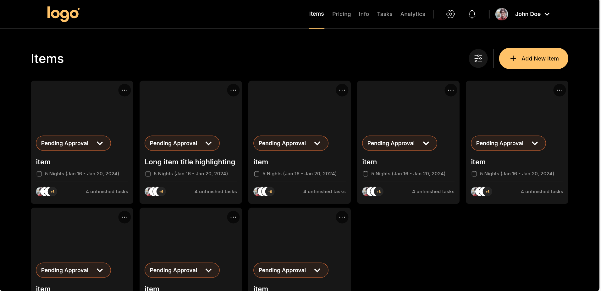
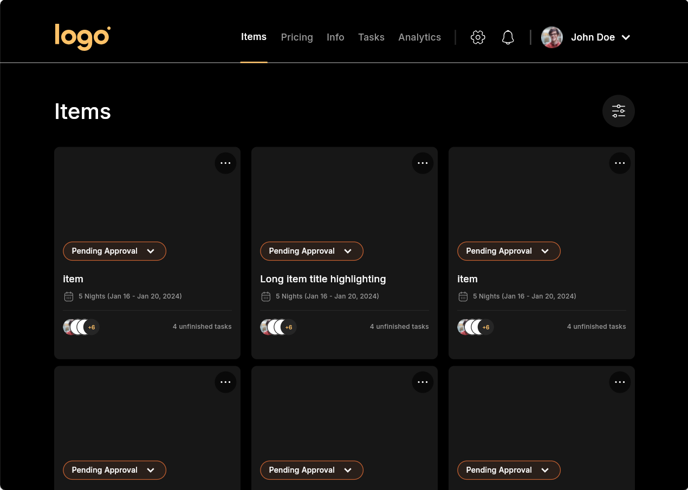

<h1>Flutter_responsive</h1>

This project is a Flutter web application designed to practice and demonstrate responsive user interface (UI) design across multiple devices. The application showcases how Flutter can adapt its layout and styling to provide an optimal user experience on desktops, tablets, and mobile devices.

<h1>Project overview</h1>
In this project, you will find a variety of UI components and layouts that adjust seamlessly to different screen sizes. This implementation helps reinforce the principles of responsive design, ensuring that users have a consistent and user-friendly experience regardless of the device they are using.

<h1>Features</h1>
Responsive Layouts: Adapts to different screen sizes, including desktops, tablets, and mobile devices.
Dynamic Font Sizing: Utilizes responsive typography to ensure text is readable on all devices.
Fluid Design: Implements a fluid design approach, allowing components to resize and reposition based on the available screen space.

<h1>Screenshots</h1>

<h2>Desktop View</h2>
</img>

<h2>Tablet View</h2>
</img>

<h2>Mobile View</h2>
</img>

